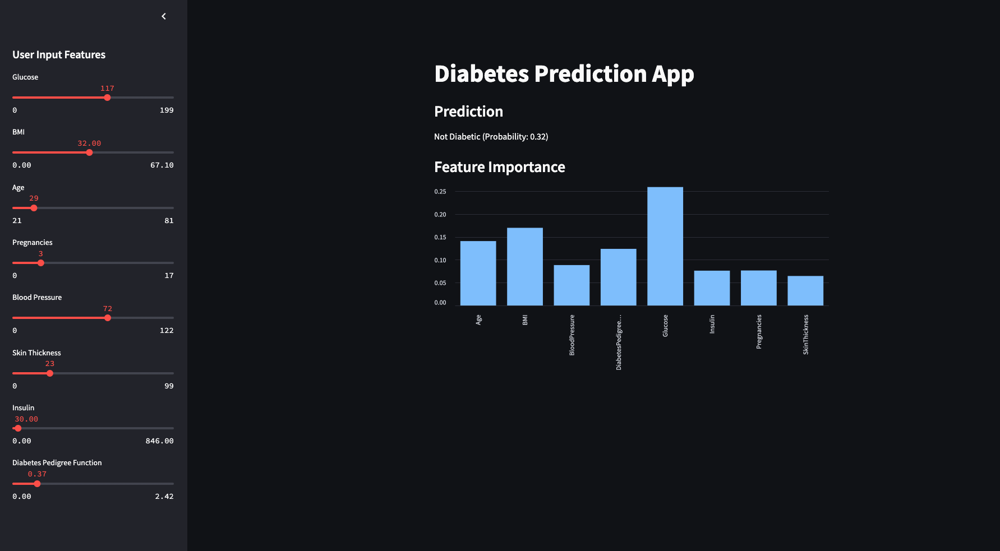

# Diabetes Prediction Project

## Overview
This project aims to predict the likelihood of diabetes in patients using machine learning models. The project includes data preprocessing, model training, evaluation, and feature importance analysis.

## Project Structure
- `app.py`: Main application script.
- `diabetes_model.pkl`: Trained machine learning model.
- `train_and_generate_importance.py`: Script to train the model and generate feature importance plot.
- `important_features.csv`: CSV file showing the important features.
- `important_features.png`: Image showing the important features.
- `dataset/diabetes.csv`: Dataset used for training and evaluation.
- `notebooks/`: Jupyter notebooks for exploratory data analysis and model training.

## Data Description
The dataset used for training the model is the Pima Indians Diabetes Database. It contains 768 records with the following features:
- `Pregnancies`: Number of times pregnant
- `Glucose`: Plasma glucose concentration a 2 hours in an oral glucose tolerance test
- `BloodPressure`: Diastolic blood pressure (mm Hg)
- `SkinThickness`: Triceps skin fold thickness (mm)
- `Insulin`: 2-Hour serum insulin (mu U/ml)
- `BMI`: Body mass index (weight in kg/(height in m)^2)
- `DiabetesPedigreeFunction`: Diabetes pedigree function
- `Age`: Age (years)
- `Outcome`: Class variable (0 or 1) indicating whether the patient has diabetes

## Setup
1. Clone the repository:
   ```bash
   git clone https://github.com/delabi/Diabetes_Predictor.git
   ```

2. Install the required packages:
   ```bash
   pip install -r requirements.txt
   ```

## Usage
1. To run the project:
   ```bash
   ./run_project.sh
   ```

## Features
- User can input health metrics through the Streamlit app.
- The app predicts whether the user has diabetes and shows the probability.
- The app displays the feature importance of the model in order.

